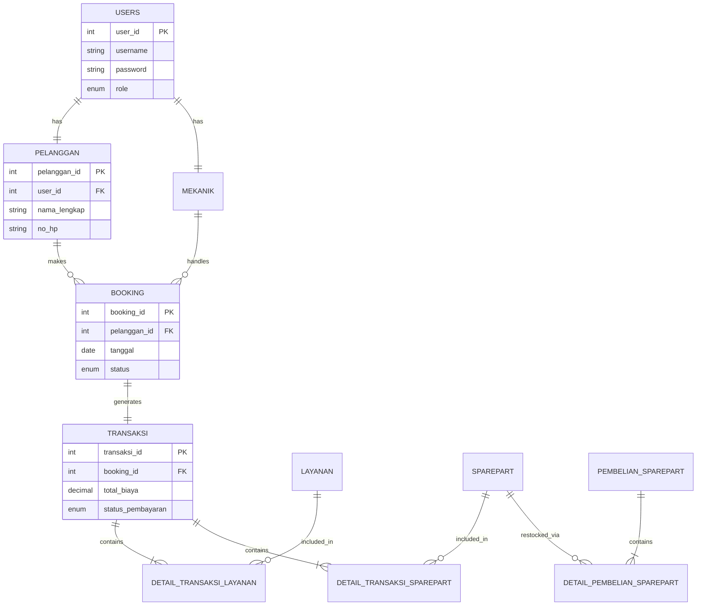
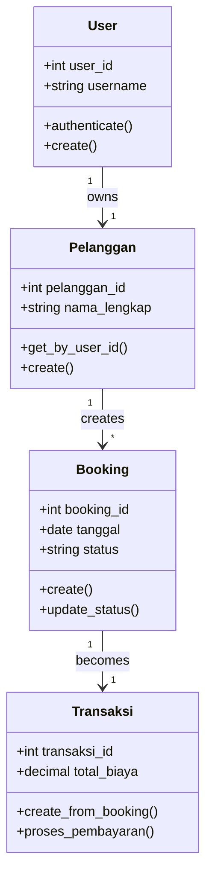
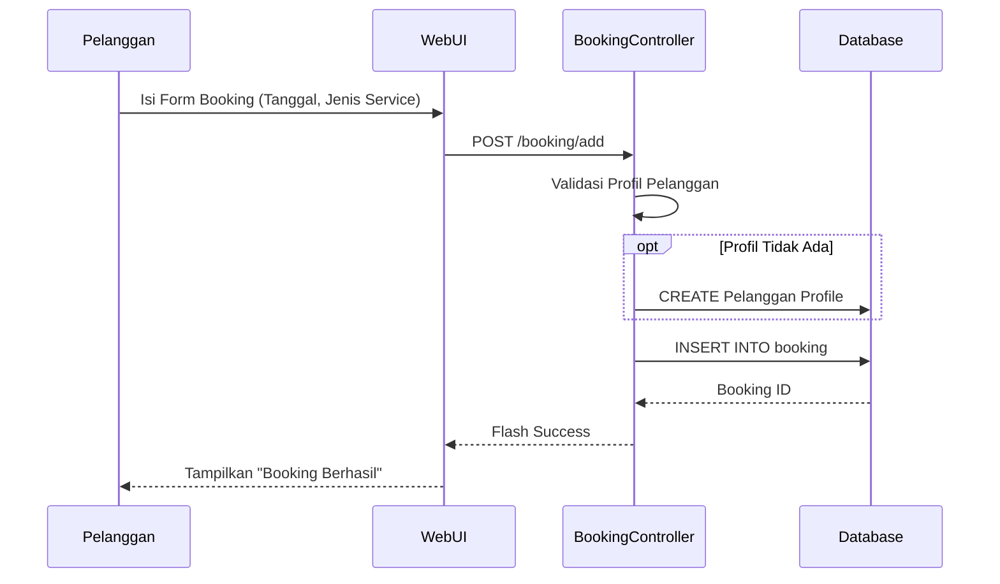
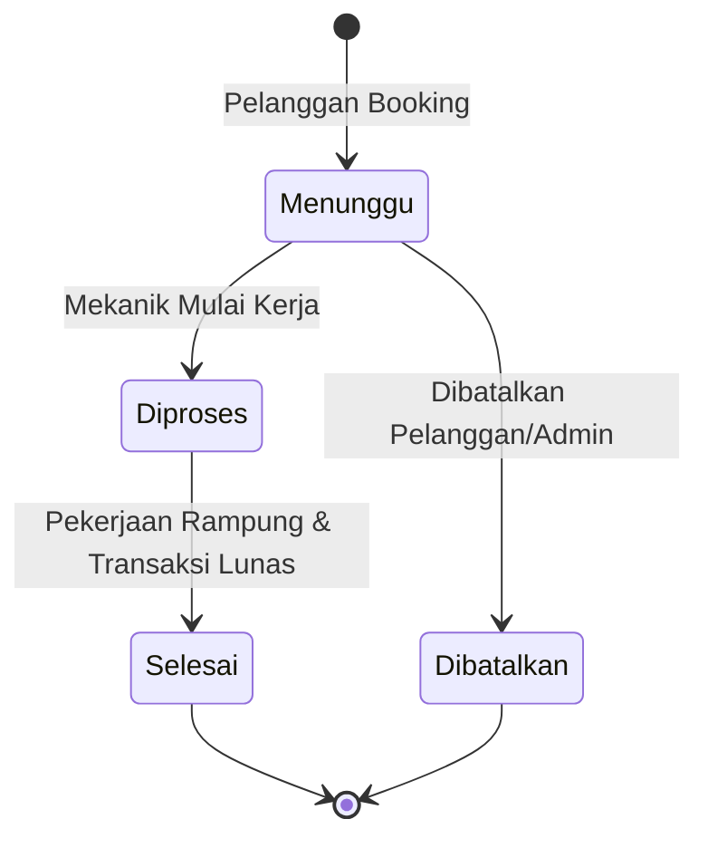

# Laporan Tugas Besar Basis Data Lanjutan

**Judul Proyek:** Sistem Informasi Manajemen Bengkel Mobil  
**Mata Kuliah:** Basis Data Lanjutan

---

## 1. Pendahuluan

### 1.1. Latar Belakang

Dalam era digitalisasi saat ini, efisiensi operasional menjadi kunci utama kesuksesan bisnis, termasuk dalam industri jasa otomotif seperti bengkel mobil. Pengelolaan data secara manual seringkali menyebabkan inefisiensi, seperti hilangnya data riwayat servis pelanggan, kesalahan pencatatan stok sparepart, perhitungan biaya yang tidak akurat, dan antrean yang tidak terkelola dengan baik.

Sistem Informasi Manajemen Bengkel Mobil ini dirancang untuk mengatasi permasalahan tersebut dengan menyediakan platform terintegrasi yang menghubungkan pelanggan, mekanik, dan administrator bengkel. Sistem ini tidak hanya mencatat transaksi, tetapi juga mengelola alur bisnis mulai dari pendaftaran pelanggan, pemesanan (booking) servis, pengelolaan stok, hingga pelaporan keuangan.

### 1.2. Tujuan

Tujuan dari pengembangan sistem ini adalah:

1.  **Digitalisasi Proses Bisnis**: Mengubah pencatatan manual menjadi sistem basis data yang terstruktur.
2.  **Efisiensi Operasional**: Mempercepat proses booking, transaksi, dan pengecekan stok.
3.  **Integritas Data**: Memastikan data pelanggan, riwayat servis, dan keuangan tersimpan dengan aman dan konsisten.
4.  **Analisis Bisnis**: Menyediakan laporan otomatis untuk membantu pengambilan keputusan manajerial.

---

## 2. Deskripsi Proyek

Aplikasi **Camelia (Sistem Bengkel Mobil)** adalah aplikasi berbasis web yang dibangun menggunakan arsitektur MVC (Model-View-Controller). Aplikasi ini memiliki tiga aktor utama dengan hak akses yang berbeda:

1.  **Administrator**:

    - Mengelola data master (Layanan, Sparepart, User, Mekanik).
    - Melihat dashboard statistik dan laporan pendapatan.
    - Melakukan restock (pembelian) sparepart dari supplier.
    - Memantau seluruh aktivitas booking dan transaksi.

2.  **Mekanik**:

    - Melihat jadwal pekerjaan (booking) yang ditugaskan.
    - Memproses booking (update status dari Menunggu -> Diproses -> Selesai).
    - Membuat transaksi servis dan menambahkan detail penggunaan sparepart.

3.  **Pelanggan**:
    - Melakukan pendaftaran akun dan melengkapi profil.
    - Melakukan booking servis secara online (menentukan tanggal, jam, dan keluhan).
    - Melihat riwayat servis dan status booking kendaraan mereka.

---

## 3. Spesifikasi Database

Database sistem ini menggunakan **MySQL** dengan struktur relasional yang ketat untuk menjamin konsistensi data. Berikut adalah rincian lengkap tabel-tabel yang digunakan.

### 3.1. Struktur Tabel Utama

Berikut adalah daftar tabel inti dalam sistem beserta fungsinya:

| Nama Tabel    | Fungsi Utama                                          | Keterangan                                                                                      |
| :------------ | :---------------------------------------------------- | :---------------------------------------------------------------------------------------------- |
| **users**     | Menyimpan data akun login (username, password, role). | Tabel induk untuk autentikasi. Membedakan hak akses (Admin/Mekanik/Pelanggan).                  |
| **pelanggan** | Menyimpan profil lengkap customer.                    | Terhubung _One-to-One_ dengan tabel `users`. Menyimpan data seperti No HP dan Alamat.           |
| **mekanik**   | Menyimpan data karyawan teknis bengkel.               | Terhubung _One-to-One_ dengan tabel `users`. Mencatat spesialisasi mekanik.                     |
| **layanan**   | Katalog jasa servis yang tersedia.                    | Berisi nama layanan, kategori (Ringan/Berat), estimasi waktu, dan harga standar.                |
| **sparepart** | Katalog suku cadang dan stok barang.                  | Mencatat stok fisik, harga beli (HPP), dan harga jual. Dilengkapi fitur _warning_ stok menipis. |
| **booking**   | Mencatat reservasi jadwal servis.                     | Tabel transaksi utama yang menghubungkan Pelanggan, Mekanik, dan Jadwal.                        |
| **transaksi** | Mencatat pembayaran dan tagihan akhir.                | Menampung total biaya (jasa + barang), status pembayaran, dan tanggal bayar.                    |

### 3.2. Tabel Detail & Logistik (Normalisasi)

Untuk memenuhi kaidah normalisasi (menghindari duplikasi data dalam satu baris), detail item dipisahkan ke tabel tersendiri:

- **detail_transaksi_layanan**: Menyimpan daftar jasa apa saja yang diambil dalam satu transaksi.
- **detail_transaksi_sparepart**: Menyimpan daftar suku cadang yang dipakai dalam satu transaksi (mengurangi stok `sparepart`).
- **pembelian_sparepart** & **detail_pembelian_sparepart**: Mencatat riwayat kulakan (restock) barang dari supplier untuk menambah stok gudang.

### 3.3. Relasi Antar Tabel (E-R)

1.  **Users ↔ Pelanggan/Mekanik**: Relasi _One-to-One_. Setiap akun login pasti milik satu entitas spesifik (Pelanggan atau Mekanik), tidak bisa keduanya.
2.  **Pelanggan ↔ Booking**: Relasi _One-to-Many_. Seorang pelanggan setia bisa memiliki banyak riwayat booking dari waktu ke waktu.
3.  **Booking ↔ Transaksi**: Relasi _One-to-One_. Setiap satu perjanjian servis (booking) akan menelurkan tepat satu tagihan (transaksi).
4.  **Transaksi ↔ Layanan/Sparepart**: Relasi _Many-to-Many_. Sebuah transaksi bisa berisi banyak jenis layanan (misal: Ganti Oli + Tune Up) dan banyak sparepart. Relasi ini dipecah menggunakan tabel detail.

---

## 4. Spesifikasi Diagram

Berikut adalah visualisasi alur sistem menggunakan diagram standar UML.

### 4.1. Entity Relationship Diagram (ERD)

**Penjelasan Diagram:**
Diagram ini menggambarkan "peta" database. Terlihat bahwa `USERS` adalah pusat autentikasi. `BOOKING` menjadi jembatan operasional yang menghubungkan `PELANGGAN` dengan `MEKANIK`. Akhirnya, `BOOKING` bermuara ke `TRANSAKSI` yang memiliki rincian biaya dari tabel-tabel detail.

### 4.2. Class Diagram (Arsitektur Aplikasi)

**Penjelasan Diagram:**
Diagram ini menunjukkan struktur kode program (Model). Kelas `User` adalah induk yang memiliki metode login (`authenticate`). Kelas `Booking` memiliki logika bisnis untuk mengubah status pekerjaan, sedangkan kelas `Transaksi` bertanggung jawab menghitung total biaya. Diagram ini mencerminkan konsep OOP (Object Oriented Programming) yang diterapkan di backend Python.

### 4.3. Sequence Diagram: Alur Booking

**Penjelasan Diagram:**
Diagram ini menceritakan "cerita" satu proses: **Bagaimana Pelanggan Memesan Servis**.

1.  Pelanggan mengisi form di website.
2.  Data dikirim ke server (`BookingController`).
3.  Server mengecek: "Apakah pelanggan ini sudah punya profil lengkap?".
4.  Jika belum (blok _opt_), server otomatis membuatkan profil sementara agar tidak error.
5.  Baru kemudian data booking disimpan ke database.
6.  Sistem memberi notifikasi "Berhasil" ke pelanggan.

### 4.4. State Diagram: Status Booking

**Penjelasan Diagram:**
Diagram ini menjelaskan siklus hidup sebuah pesanan servis.

1.  Awalnya, status adalah **Menunggu** (saat baru dipesan).
2.  Berubah menjadi **Diproses** saat mekanik mulai mengerjakan mobil.
3.  Berakhir menjadi **Selesai** setelah mobil jadi dan pembayaran lunas.
4.  Atau bisa ke jalur **Dibatalkan** jika pelanggan membatalkan pesanan di awal.

---

## 5. Implementasi Database

Database diimplementasikan menggunakan MySQL dengan fitur-fitur lanjutan untuk menjaga konsistensi data.

### 5.1. Stored Procedures

Digunakan untuk mengenkapsulasi logika bisnis yang kompleks dan berat langsung di mesin database agar performansi tinggi.

- **`buat_booking`**: Prosedur "pintar" yang memastikan data booking tersimpan dengan aman, sekaligus memvalidasi apakah ID pelanggan valid sebelum insert.
- **`proses_pembayaran`**: Prosedur atomik yang melakukan dua hal sekaligus: mencatat pembayaran LUNAS di tabel transaksi DAN mengubah status booking menjadi SELESAI. Ini mencegah data tidak sinkron (misal: sudah bayar tapi status masih diproses).
- **`beli_sparepart`**: Menangani restock barang gudang. Menggunakan teknik _locking_ agar jika ada dua admin menginput stok bersamaan, hitungannya tidak selisih.

### 5.2. Triggers

Robot otomatis yang bekerja di balik layar database:

- **`after_insert_detail_sparepart`**: Setiap kali suku cadang dipakai di transaksi, trigger ini otomatis mengurangi stok di tabel master barang. Tidak perlu coding manual pengurangan stok di aplikasi.
- **`update_total_transaksi`**: Kalkulator otomatis. Setiap kali admin menambahkan item oli atau jasa ke transaksi, trigger ini langsung menjumlahkan ulang Grand Total tagihan pelanggan.

### 5.3. Views

Tabel virtual untuk mempermudah pembuatan laporan:

- `view_booking_pelanggan`: Menggabungkan 4 tabel sekaligus (Booking, User, Pelanggan, Mekanik) menjadi satu tampilan siap baca.
- `view_laporan_pendapatan`: Melakukan rekapitulasi (sum) per bulan secara otomatis, memudahkan pembuatan grafik pendapatan di dashboard.

---

## 6. Implementasi Aplikasi

### 6.1. Teknologi yang Digunakan

- **Backend**: **Python 3.11** dengan Framework **Flask**. Dipilih karena pengembangan yang cepat, kode yang bersih, dan keamanan yang terjamin.
- **Database**: **MySQL** dengan driver `mysqlclient` untuk koneksi yang stabil dan cepat.
- **Frontend**: **Bootstrap 5** untuk tampilan responsif (bagus di HP dan Laptop) dan desain modern _Playful Geometric_.

### 6.2. Arsitektur MVC (Model-View-Controller)

Pola desain yang memisahkan tugas agar kode rapi:

- **Models (Otak Data)**: File Python yang isinya hanya kode SQL (`SELECT`, `INSERT`, `UPDATE`). Contoh: `models/booking.py`.
- **Views (Tampilan)**: File HTML yang dilihat user. Menggunakan logic **Jinja2** untuk menampilkan data dari database ke tabel HTML secara dinamis.
- **Controllers (Pengatur Lalu Lintas)**: File yang menerima klik user, menyuruh Model mengambil data, dan mengirimkannya ke View. Contoh: `transaksi_controller.py`.

### 6.3. Fitur Unggulan

1.  **Dashboard Real-Time**: Grafik pendapatan dan status booking yang langsung berubah begitu ada transaksi baru.
2.  **Auto-Profile (Fitur Cerdas)**: Mencegah error sistem. Jika user lupa isi profil tapi langsung mau booking, sistem otomatis membuatkan profil darurat agar booking tetap sukses.
3.  **Keamanan Berlapis (RBAC)**: Mekanisme proteksi di mana Pelanggan tidak bisa masuk halaman Admin, dan sebaliknya.

---

## 7. Penutup

### 7.1. Kesimpulan

Proyek "Sistem Informasi Manajemen Bengkel Mobil" ini adalah bukti implementasi nyata dari teori Basis Data Lanjutan. Dengan memanfaatkan fitur canggih database seperti **Stored Procedure** untuk logika bisnis dan **Trigger** untuk otomatisasi, aplikasi ini menjadi handal dan data tetap konsisten (tidak berantakan). Integrasi dengan antarmuka web yang modern menjadikan sistem ini siap pakai untuk kebutuhan bisnis bengkel sebenarnya.

### 7.2. Saran Pengembangan

Agar sistem ini semakin sempurna di masa depan, beberapa hal bisa ditambahkan:

- **Integrasi Payment Gateway**: Agar bisa bayar pakai GoPay/OVO/QRIS sungguhan secara otomatis.
- **Notifikasi WhatsApp**: Mengirim pesan WA otomatis ke pelanggan saat mobil sudah selesai diservis.
- **Aplikasi Mobile (Android/iOS)**: Agar pelanggan lebih mudah booking lewat aplikasi khusus.

---
