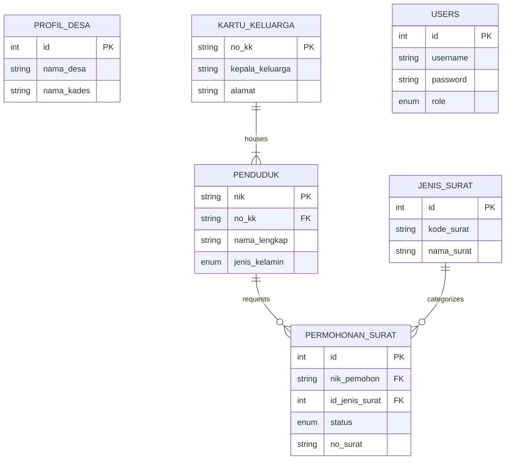
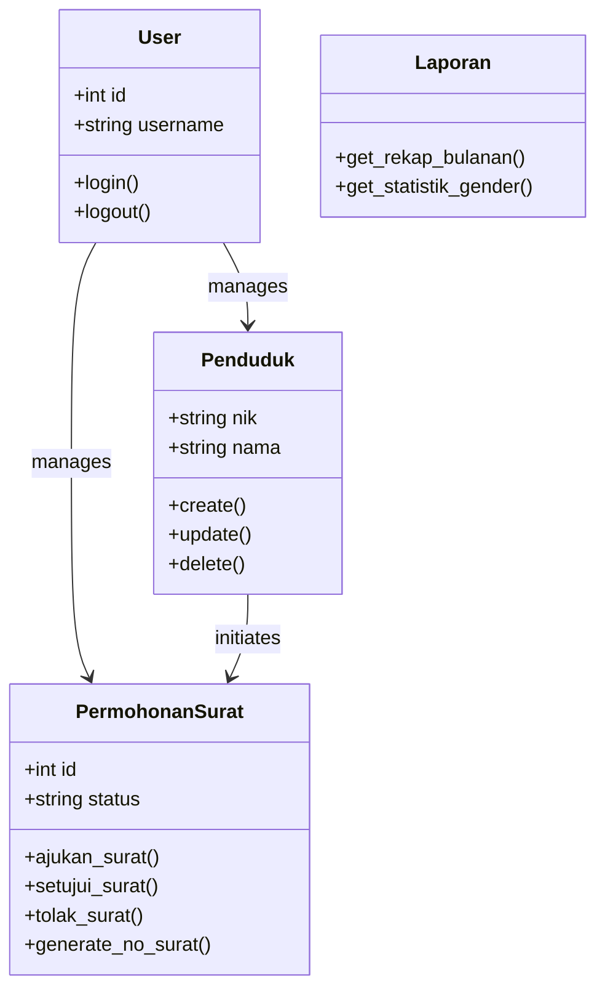
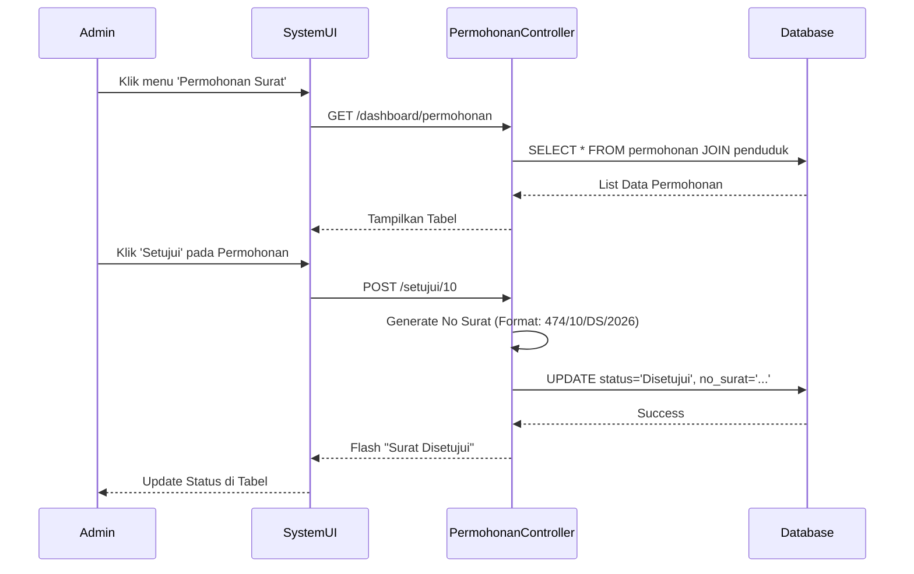

# Laporan Tugas Besar Basis Data Lanjutan

**Judul Proyek:** Sistem Informasi Pelayanan Administrasi Desa (SIPAD) - "Ciawi Asih"
**Mata Kuliah:** Basis Data Lanjutan
**Nama:** Diva Baihaqi

---

## 1. Pendahuluan

### 1.1. Latar Belakang

Dalam konteks pemerintahan desa, pelayanan administrasi kependudukan merupakan fungsi vital. Proses manual yang selama ini berjalan di kantor desa seringkali mengalami kendala, seperti pencarian data penduduk yang lambat, kesulitan dalam rekapitulasi jumlah penduduk (statistik), dan antrean fisik warga hanya untuk mengajukan surat pengantar sederhana.

Sistem Informasi Pelayanan Administrasi Desa (SIPAD) ini dikembangkan untuk menjawab tantangan tersebut. Sistem ini mendigitalisasi data kependudukan (Kartu Keluarga dan Penduduk individual) serta mengotomatisasi proses pengajuan dan pencetakan surat keterangan, sehingga pelayanan kepada masyarakat menjadi lebih cepat, akurat, dan transparan.

### 1.2. Tujuan

Tujuan dari pengembangan sistem ini adalah:

1.  **Sentralisasi Data**: Mengelola data penduduk dan kepala keluarga dalam satu basis data terpusat yang terintegrasi.
2.  **Pelayanan Mandiri & Cepat**: Memungkinkan warga (di masa depan) atau staff untuk memproses pengajuan surat dengan cepat.
3.  **Akurasi Statistik**: Menyajikan data statistik demografi (gender, usia, pekerjaan) secara _real-time_ untuk mendukung pengambilan kebijakan desa.
4.  **Tertib Administrasi**: Mencatat setiap histori permohonan surat (nomor surat, tanggal, status) secara sistematis.

---

## 2. Deskripsi Proyek

Aplikasi **SIPAD Ciawi Asih** adalah aplikasi berbasis web yang dibangun dengan framework Flask (Python) dan database MySQL. Aplikasi ini difokuskan untuk memudahkan perangkat desa dalam mengelola data warga dan melayani permohonan surat.

### 2.1. Aktor & Hak Akses

1.  **Admin (Operator Desa)**:
    - **Akses Penuh (Super User)**.
    - Mengelola seluruh Data Master (Penduduk, KK, Jenis Surat).
    - Memanajemen akun pengguna lain (Reset password staff, tambah akun).
    - Memverifikasi akhir semua jenis surat.
2.  **Pimpinan (Kuwu / Kepala Desa)**:
    - **Akses Monitoring**.
    - Hanya dapat melihat Laporan & Statistik (Berapa surat keluar, Demografi penduduk).
    - Tidak melakukan input data teknis harian.
3.  **Staff (Perangkat Desa / Kasi / Kaur)**:
    - **Akses Terbatas (Tupoksi)**.
    - Hanya dapat melihat dan mengelola data yang diinput oleh dirinya sendiri.
    - Menangani jenis surat spesifik sesuai bidangnya (misal: Kasi Pemerintahan mengurus Domisili).
4.  **Penduduk (Warga)**:
    - **Akses Mandiri**.
    - Login untuk mengajukan permohonan surat dari rumah.
    - Melihat status pengajuan (Menunggu/Disetujui/Ditolak).
    - Mengelola profil pribadi.

---

## 3. Spesifikasi Database

Database sistem ini menggunakan **MySQL** dengan nama skema `sid_desa`. Struktur database dirancang untuk menjaga konsistensi data menggunakan _Foreign Key_ dan normalisasi data.

### 3.1. Struktur Tabel

Berikut adalah rincian tabel yang digunakan dalam sistem:

#### A. Tabel Master

**1. Tabel `users`**
Menyimpan data akun untuk autentikasi admin dan perangkat desa.
| Kolom | Tipe Data | Keterangan |
| :--- | :--- | :--- |
| `id` | INT (PK) | Auto Increment |
| `username` | VARCHAR(50) | Unik |
| `password` | VARCHAR(255) | Disimpan dalam bentuk _hash_ (Bcrypt) |
| `role` | ENUM | Pilihan: `admin`, `pimpinan`, `staff`, `penduduk` |

**2. Tabel `profil_desa`**
Menyimpan konfigurasi data instansi desa untuk dipanggil pada kop surat.
| Kolom | Tipe Data | Keterangan |
| :--- | :--- | :--- |
| `id` | INT (PK) | Default 1 |
| `nama_desa` | VARCHAR(100) | Contoh: Ciawi Asih |
| `alamat_kantor`| TEXT | Alamat lengkap balai desa |
| `kecamatan` | VARCHAR(100) | - |
| `nama_kades` | VARCHAR(100) | Nama penandatangan surat |
| `nip_kades` | VARCHAR(50) | NIP Kepala Desa |

**3. Tabel `jenis_surat`**
Katalog jenis surat yang dapat dilayani sistem.
| Kolom | Tipe Data | Keterangan |
| :--- | :--- | :--- |
| `id` | INT (PK) | Auto Increment |
| `kode_surat` | VARCHAR(20) | Kode klasifikasi arsip (misal: 474) |
| `nama_surat` | VARCHAR(100) | Judul surat (misal: SKCK) |
| `template_file`| VARCHAR(100) | Referensi file template (jika ada) |

#### B. Tabel Kependudukan

**4. Tabel `kartu_keluarga` (KK)**
Tabel induk untuk satu keluarga.
| Kolom | Tipe Data | Keterangan |
| :--- | :--- | :--- |
| `no_kk` | VARCHAR(16) (PK)| Nomor Kartu Keluarga (Unik) |
| `kepala_keluarga`| VARCHAR(100) | Nama Kepala Keluarga |
| `alamat`, `rt`, `rw`| TEXT / VARCHAR | Alamat domisili |

**5. Tabel `penduduk`**
Menyimpan data biodata setiap individu warga.
| Kolom | Tipe Data | Keterangan |
| :--- | :--- | :--- |
| `nik` | VARCHAR(16) (PK)| Nomor Induk Kependudukan (Unik) |
| `no_kk` | VARCHAR(16) (FK)| Referensi ke tabel `kartu_keluarga` |
| `nama_lengkap` | VARCHAR(100) | Nama lengkap penduduk |
| `jenis_kelamin` | ENUM('L', 'P') | Laki-laki / Perempuan |
| `pekerjaan` | VARCHAR(50) | - |
| `status_perkawinan`| ENUM | Status pernikahan |

#### C. Tabel Transaksi / Layanan

**6. Tabel `permohonan_surat`**
Mencatat setiap transaksi pengajuan surat.
| Kolom | Tipe Data | Keterangan |
| :--- | :--- | :--- |
| `id` | INT (PK) | Auto Increment |
| `nik_pemohon` | VARCHAR(16) (FK)| NIK warga yang mengajukan (Bisa NULL) |
| `id_jenis_surat`| INT (FK) | Jenis surat yang diajukan |
| `keperluan` | TEXT | Alasan pengajuan surat |
| `status` | ENUM | `Pending`, `Disetujui`, `Ditolak` |
| `no_surat` | VARCHAR(50) | Diisi otomatis saat disetujui (Format: Kode/No/Tahun) |
| `created_at` | TIMESTAMP | Waktu pengajuan |

### 3.2. Relasi Antar Tabel (E-R)

1.  **Kartu Keluarga - Penduduk (1:N)**: Satu nomor KK dapat menaungi banyak anggota keluarga (penduduk). Jika KK dihapus, referensi di penduduk akan diset ke NULL (`ON DELETE SET NULL`) untuk keamanan data.
2.  **Penduduk - Permohonan Surat (1:N)**: Satu warga dapat mengajukan permohonan surat berkali-kali. Relasi didasarkan pada kolom `nik`.
3.  **Jenis Surat - Permohonan Surat (1:N)**: Satu jenis surat (misal: Keterangan Domisili) bisa diajukan oleh banyak pemohon berbeda.

---

## 4. Spesifikasi Diagram

Berikut adalah pemodelan visual dari sistem yang dibangun.

### 4.1. Entity Relationship Diagram (ERD)

Diagram ini menggambarkan struktur tabel dan hubungan foreign key antar entitas dalam database `sid_desa`.

### 4.2. Class Diagram (Model Architecture)

Diagram ini merepresentasikan struktur logika aplikasi Backend (Flask), dimana Controller berinteraksi dengan Database melalui Cursor MySQL.

### 4.3. Sequence Diagram: Alur Pengajuan Surat

Diagram ini menjelaskan urutan proses ketika Admin memproses surat yang diajukan.

---

## 5. Implementasi & Detail Teknis

### 5.1. Teknologi

- **Backend**: Python Flask 2.2.5. Framework mikro yang ringan namun _powerful_.
- **Database**: MySQL 8. Menggunakan `Flask-MySQLdb` connector.
- **Security**: `Flask-Bcrypt` digunakan untuk melakukan _hashing_ password admin, memastikan password tidak tersimpan dalam bentuk _plain text_.
- **Frontend**: HTML5 & CSS (Bootstrap 5). Desain responsif (_mobile-friendly_) dengan tema dashboard modern.

### 5.2. Fitur Unggulan

1.  **Dashboard Statistik Real-time**:
    Halaman utama dashboard menyajikan grafik dan kartu statistik yang menghitung:
    - Total Penduduk & Kepala Keluarga.
    - Komposisi Gender (Laki-laki vs Perempuan).
    - Tren Permohonan Surat per Bulan (Grafik Batang).
2.  **Validasi Penduduk Otomatis**:
    Saat mengajukan surat, sistem otomatis memvalidasi apakah NIK terdaftar di database penduduk. Jika tidak, pengajuan ditolak demi keamanan data.
3.  **Generasi Nomor Surat Otomatis**:
    Sistem memiliki algoritma otomatis untuk menerbitkan nomor surat dengan format standar kedinasan (Kode Klasifikasi / ID Unik / Kode Desa / Tahun), mencegah duplikasi nomor surat.
4.  **Cetak Surat Dinamis**:
    Surat dicetak langsung dari sistem menggunakan data yang tersimpan di database, digabungkan dengan data `Profil Desa` (Kop Surat, Nama Kades, NIP).

### 5.3. Struktur Kode (MVC Pattern)

Kode program diorganisir menggunakan pola MVC sederhana:

- **app.py (Controller)**: Menangani _routing_ URL (misal: `/login`, `/dashboard`) dan logika bisnis.
- **templates/ (View)**: Berisi file HTML dengan Jinja2 templating untuk menampilkan data dinamis.
- **database/ (Model Logic)**: Skema database dan skrip _seeding_ data awal.

---

## 6. Penutup

### 6.1. Kesimpulan

Pengembangan "Sistem Informasi Pelayanan Administrasi Desa (SIPAD)" ini telah berhasil menyediakan solusi digital untuk manajemen data desa. Implementasi basis data relasional memastikan data penduduk tersimpan rapi tanpa redundansi. Fitur validasi NIK dan persetujuan bertingkat menjaga validitas setiap dokumen yang dikeluarkan oleh desa.

### 6.2. Saran Pengembangan

Untuk pengembangan selanjutnya, sistem dapat ditingkatkan dengan:

1.  **Fitur Tanda Tangan Digital (QR Code)**: Memverifikasi keaslian surat secara digital tanpa tanda tangan basah.
2.  **Notifikasi WhatsApp**: Mengintegrasikan API WhatsApp agar warga mendapat notifikasi _real-time_ saat surat selesai diproses.
3.  **Level Akses RT/RW**: Memberikan akses terbatas bagi ketua RT/RW untuk memverifikasi warganya sebelum masuk ke admin desa.

---

_Laporan ini disusun untuk memenuhi Tugas Besar Mata Kuliah Basis Data Lanjutan._
