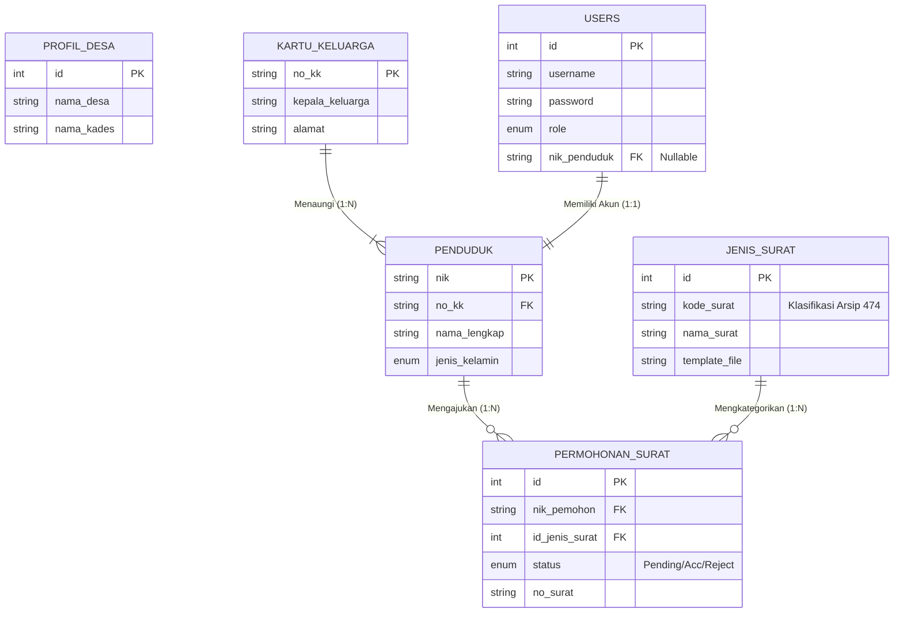
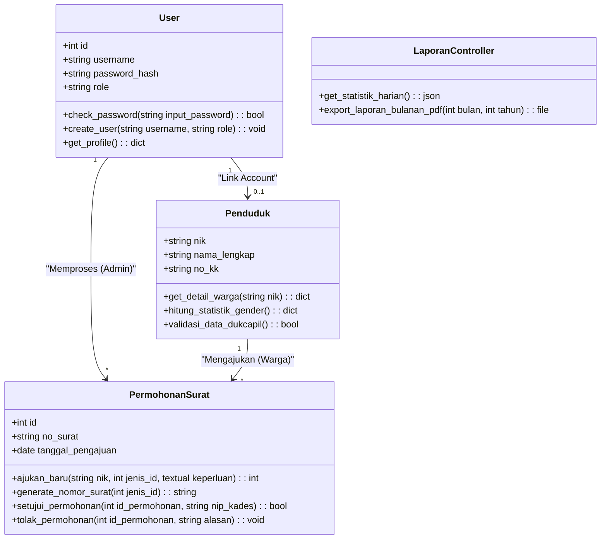
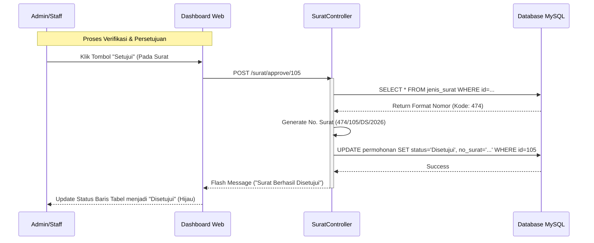

# Laporan Tugas Besar Basis Data Lanjutan

**Judul Proyek:** Sistem Informasi Pelayanan Administrasi Desa (SIPAD) - "Ciawi Asih"
**Mata Kuliah:** Basis Data Lanjutan
**Nama:** Diva Baihaqi

---

## 1. Pendahuluan

### 1.1. Latar Belakang

Dalam konteks pemerintahan desa, pelayanan administrasi kependudukan merupakan fungsi vital. Proses manual yang selama ini berjalan di kantor desa seringkali mengalami kendala, seperti pencarian data penduduk yang lambat, kesulitan dalam rekapitulasi jumlah penduduk (statistik), dan antrean fisik warga hanya untuk mengajukan surat pengantar sederhana.

Sistem Informasi Pelayanan Administrasi Desa (SIPAD) ini dikembangkan untuk menjawab tantangan tersebut. Sistem ini mendigitalisasi data kependudukan (Kartu Keluarga dan Penduduk individual) serta mengotomatisasi proses pengajuan dan pencetakan surat keterangan, sehingga pelayanan kepada masyarakat menjadi lebih cepat, akurat, dan transparan.

### 1.2. Tujuan

Tujuan dari pengembangan sistem ini adalah:

1.  **Sentralisasi Data**: Mengelola data penduduk dan kepala keluarga dalam satu basis data terpusat yang terintegrasi.
2.  **Pelayanan Mandiri & Cepat**: Memungkinkan warga (di masa depan) atau staff untuk memproses pengajuan surat dengan cepat.
3.  **Akurasi Statistik**: Menyajikan data statistik demografi (gender, usia, pekerjaan) secara _real-time_ untuk mendukung pengambilan kebijakan desa.
4.  **Tertib Administrasi**: Mencatat setiap histori permohonan surat (nomor surat, tanggal, status) secara sistematis.

### 1.3. Filosofi Desain ("Organic Modernism")

Sistem ini tidak hanya dirancang sebagai alat pendataan, tetapi sebagai wajah digital desa yang ramah. Visual antarmuka menggunakan tema **Sistem Desa Digital Ciawiasih** dengan pendekatan _Glassmorphism_ (transparansi) yang memberikan kesan modern namun tetap bersih. Sistem juga mengadopsi prinsip _Mobile-First_, memastikan warga dapat mengakses layanan dengan nyaman melalui _smartphone_ mereka tanpa perlu instalasi aplikasi tambahan.

### 1.4. Lingkungan Pengembangan (_Development Environment_)

Pengembangan sistem ini dilakukan menggunakan perangkat keras dan perangkat lunak dengan spesifikasi sebagai berikut:

| Kategori               | Spesifikasi / Tools                                        |
| :--------------------- | :--------------------------------------------------------- |
| **Perangkat Keras**    | Laptop Processor Intel/AMD, RAM 8GB, SSD 256GB             |
| **Sistem Operasi**     | Windows 10 / 11 (64-bit)                                   |
| **Text Editor / IDE**  | Visual Studio Code (dengan ekstensi Python & Jinja2)       |
| **Local Server**       | Laragon (Apache & MySQL 8.0)                               |
| **Bahasa Pemrograman** | Python 3.10+ (Backend), HTML5, CSS3, JavaScript (Frontend) |
| **Database Tool**      | HeidiSQL / DBeaver / PHPMyAdmin                            |
| **Browser Pengujian**  | Google Chrome, Microsoft Edge                              |
| **Version Control**    | Git & GitHub                                               |

### 1.5. Batasan Masalah (_Project Scope_)

Agar pengembangan sistem lebih terarah dan fokus, ditetapkan batasan-batasan sebagai berikut:

1.  Sistem ini hanya mencakup administrasi di lingkup **Desa Ciawiasih**, belum terintegrasi secara _real-time_ dengan server Dinas Kependudukan (Dukcapil) Kabupaten/Pusat.
2.  Data kependudukan yang digunakan saat ini adalah data simulasi (Dummy Data) yang menyerupai struktur asli untuk keperluan pengujian fungsi.
3.  Fitur pembayaran retribusi (jika ada) belum diimplementasikan mengggunakan _Payment Gateway_ (masih pencatatan manual/tunai di kantor desa).
4.  Fitur tanda tangan digital pada surat yang dihasilkan masih berupa QR Code internal sistem, belum tersertifikasi oleh BSrE (Badan Siber dan Sandi Negara).

---

## 2. Deskripsi Proyek

Aplikasi **SIPAD Ciawi Asih** adalah aplikasi berbasis web yang dibangun dengan framework Flask (Python) dan database MySQL. Aplikasi ini difokuskan untuk memudahkan perangkat desa dalam mengelola data warga dan melayani permohonan surat.

### 2.1. Aktor & Hak Akses (Role-Based Access Control)

Sistem menerapkan pembagian hak akses yang tegas untuk menjaga keamanan dan efektivitas alur kerja:

1.  **Admin (Sekretaris Desa)**:

    - **Akses Penuh (Super User)**.
    - Mengelola seluruh Data Master (Penduduk, KK, Jenis Surat).
    - Memanajemen akun pengguna lain (Staff & Pimpinan).
    - Melakukan verifikasi berkas administratif sebelum diajukan ke Pimpinan.

2.  **Pimpinan (Kuwu / Kepala Desa)**:

    - **Akses Monitoring & Approval**.
    - Melihat Laporan Statistik Kependudukan & Kinerja Desa (Executive Dashboard).
    - Melakukan persetujuan akhir (Digital Approval) untuk dokumen penting.
    - Tidak dibebani dengan input data teknis harian.

3.  **Staff (Kasi Pelayanan / Kasi Pemerintahan)**:

    - **Akses Operasional (Front Office)**.
    - Melayani warga yang datang langsung ke kantor desa (_Walk-in Service_).
    - Memverifikasi kelengkapan berkas persyaratan permohonan surat.
    - Mencetak surat (Hardcopy) yang telah disetujui untuk diserahkan ke warga.

4.  **Penduduk (Warga)**:
    - **Akses Mandiri (Self-Service)**.
    - Login untuk mengajukan permohonan surat secara online dari rumah.
    - Memantau status pengajuan (Pending/Disetujui/Ditolak) secara _real-time_.
    - Berinteraksi dengan **LANA** (AI Chatbot) untuk informasi layanan.

### 2.2. Fitur Unggulan Sistem

Selain manajemen database standar, sistem ini dilengkapi fitur cerdas:

- **LANA (Layanan Asisten Ciawiasih)**: Chatbot berbasis AI (Google Gemini) yang terintegrasi dengan database desa. Warga dapat bertanya "Syarat buat KTP apa?" atau "Jam berapa kantor buka?" dan dijawab otomatis oleh AI yang konteks-sadar.
- **Generasi Dokumen Otomatis**: Surat yang disetujui dapat langsung diunduh dalam format **PDF Resmi** lengkap dengan Kop Surat, Nomor Surat Otomatis, dan Tanda Tangan Pejabat.
- **Validasi NIK Terintegrasi**: Sistem otomatis menolak permohonan jika NIK pemohon tidak terdaftar di database kependudukan desa, mencegah pemalsuan data.

---

## 3. Spesifikasi Database

Database sistem ini menggunakan **MySQL** dengan nama skema `sid_desa`. Struktur database dirancang untuk menjaga konsistensi data menggunakan relasi antar tabel (_Foreign Key_) dan normalisasi data.

### 3.1. Struktur Tabel Utama

Berikut adalah rincian tabel yang digunakan dalam sistem data desa dan administrasi persuratan:

#### A. Tabel Master & Autentikasi

**1. Tabel `users`**
Menyimpan data akun untuk autentikasi pengguna (Admin, Perangkat Desa, dan Warga).

| Kolom        | Tipe Data    | Keterangan                                          |
| :----------- | :----------- | :-------------------------------------------------- |
| `id`         | INT (PK)     | _Auto Increment_                                    |
| `username`   | VARCHAR(50)  | _Unique_, nama pengguna untuk login                 |
| `password`   | VARCHAR(255) | Kata sandi terenkripsi (_Hashed_)                   |
| `role`       | ENUM         | Pilihan: `admin`, `kades`, `staff`, `penduduk`      |
| `created_at` | TIMESTAMP    | Waktu pembuatan akun (Default: _Current Timestamp_) |

**2. Tabel `jenis_surat`**
Menyimpan katalog jenis surat yang dapat dilayani oleh sistem.

| Kolom           | Tipe Data    | Keterangan                                  |
| :-------------- | :----------- | :------------------------------------------ |
| `id`            | INT (PK)     | _Auto Increment_                            |
| `kode_surat`    | VARCHAR(20)  | Kode klasifikasi arsip surat (misal: 474)   |
| `nama_surat`    | VARCHAR(100) | Judul surat (misal: Surat Keterangan Usaha) |
| `template_file` | VARCHAR(100) | Nama file template surat yang digunakan     |

#### B. Tabel Kependudukan

**3. Tabel `kartu_keluarga`**
Tabel induk untuk menyimpan data Kartu Keluarga (KK).

| Kolom             | Tipe Data        | Keterangan                                        |
| :---------------- | :--------------- | :------------------------------------------------ |
| `no_kk`           | VARCHAR(16) (PK) | Nomor Kartu Keluarga (Unik 16 Digit)              |
| `kepala_keluarga` | VARCHAR(100)     | Nama lengkap Kepala Keluarga                      |
| `alamat`          | TEXT             | Alamat lengkap domisili                           |
| `rt` / `rw`       | VARCHAR(3)       | Nomor RT dan RW                                   |
| `desa_kelurahan`  | VARCHAR(50)      | Nama Desa / Kelurahan                             |
| `kecamatan`       | VARCHAR(50)      | Nama Kecamatan                                    |
| `kabupaten_kota`  | VARCHAR(50)      | Nama Kabupaten / Kota                             |
| `provinsi`        | VARCHAR(50)      | Nama Provinsi                                     |
| `kode_pos`        | VARCHAR(5)       | Kode Pos wilayah                                  |
| `created_at`      | TIMESTAMP        | Waktu data diinput (Default: _Current Timestamp_) |

**4. Tabel `penduduk`**
Menyimpan data biodata lengkap setiap warga.

| Kolom                            | Tipe Data        | Keterangan                                                 |
| :------------------------------- | :--------------- | :--------------------------------------------------------- |
| `nik`                            | VARCHAR(16) (PK) | Nomor Induk Kependudukan (Unik 16 Digit)                   |
| `no_kk`                          | VARCHAR(16)      | _Foreign Key_ ke tabel `kartu_keluarga`                    |
| `nama_lengkap`                   | VARCHAR(100)     | Nama lengkap penduduk sesuai KTP                           |
| `tempat_lahir`                   | VARCHAR(50)      | Kota/Kabupaten tempat lahir                                |
| `tanggal_lahir`                  | DATE             | Tanggal lahir (YYYY-MM-DD)                                 |
| `jenis_kelamin`                  | ENUM             | `L` (Laki-laki) atau `P` (Perempuan)                       |
| `agama`                          | VARCHAR(20)      | Agama yang dianut                                          |
| `pendidikan`                     | VARCHAR(50)      | Pendidikan terakhir                                        |
| `pekerjaan`                      | VARCHAR(50)      | Jenis pekerjaan                                            |
| `status_perkawinan`              | ENUM             | Status nikah (Belum Kawin, Kawin, Cerai Hidup, Cerai Mati) |
| `status_hubungan_dalam_keluarga` | ENUM             | Peran dalam KK (Kepala Keluarga, Istri, Anak, dll)         |
| `kewarganegaraan`                | VARCHAR(3)       | Default: WNI                                               |
| `nama_ayah`                      | VARCHAR(100)     | Nama Ayah Kandung                                          |
| `nama_ibu`                       | VARCHAR(100)     | Nama Ibu Kandung                                           |
| `status_penduduk`                | ENUM             | Status tinggal (`Hidup`, `Meninggal`, `Pindah`)            |
| `foto`                           | VARCHAR(255)     | Path file foto profil (Opsional)                           |

#### C. Tabel Transaksi Layanan

**5. Tabel `permohonan_surat`**
Mencatat seluruh transaksi pengajuan surat dari warga.

| Kolom                | Tipe Data    | Keterangan                                              |
| :------------------- | :----------- | :------------------------------------------------------ |
| `id`                 | INT (PK)     | _Auto Increment_                                        |
| `no_surat`           | VARCHAR(50)  | Nomor surat resmi yang digenerate sistem saat disetujui |
| `nik_pemohon`        | VARCHAR(16)  | NIK pemohon (Relasi ke tabel `penduduk`)                |
| `nama_pemohon`       | VARCHAR(100) | Nama pemohon (Backup jika NIK tidak terdaftar/manual)   |
| `no_hp`              | VARCHAR(20)  | Nomor WhatsApp untuk notifikasi status surat            |
| `id_jenis_surat`     | INT          | _Foreign Key_ ke tabel `jenis_surat`                    |
| `tanggal_permohonan` | DATE         | Tanggal pengajuan surat                                 |
| `keperluan`          | TEXT         | Deskripsi keperluan pembuatan surat                     |
| `status`             | ENUM         | Status proses: `Pending`, `Disetujui`, `Ditolak`        |
| `created_at`         | TIMESTAMP    | Waktu sistem mencatat pengajuan                         |

### 3.2. Relasi Antar Tabel (Logical Entity Relationship)

Relasi antar tabel dirancang untuk mencerminkan proses bisnis administrasi desa yang nyata:

1.  **Kartu Keluarga (KK) ↔ Penduduk (One-to-Many)**

    - **Konsep**: Satu dokumen KK (`no_kk`) menaungi banyak individu/anggota keluarga.
    - **Integritas Data**: Jika data KK dihapus (misal keluarga pindah total), maka data penduduk terkait opsional untuk dihapus atau diset `NULL` (`ON DELETE SET NULL`) agar sejarah data penduduk tetap ada di arsip desa.
    - **Kunci Relasi**: `kartu_keluarga.no_kk` (PK) → `penduduk.no_kk` (FK).

2.  **Penduduk ↔ Users (One-to-One / Optional)**

    - **Konsep**: Satu NIK penduduk hanya boleh memiliki maksimal satu akun login. Tidak semua penduduk wajib punya akun (hanya yang sudah dewasa/perlu layanan online), sehingga relasinya bersifat opsional.
    - **Integritas Data**: Data akun `users` menyimpan referensi NIK. Jika data penduduk dihapus (meninggal/pindah), akses login mereka (`users`) harus dinonaktifkan atau dihapus (`ON DELETE CASCADE`) demi keamanan.
    - **Kunci Relasi**: `penduduk.nik` (PK) → `users.nik_penduduk` (FK/Unique).

3.  **Penduduk ↔ Permohonan Surat (One-to-Many)**

    - **Konsep**: Seorang warga (`nik_pemohon`) dapat mengajukan berbagai jenis surat berkali-kali sepanjang hidupnya (misal: Surat Pengantar SKCK tahun ini, Surat Domisili tahun depan).
    - **Integritas Data**: Riwayat permohonan surat adalah arsip vital negara. Jika data penduduk dihapus, data permohonan surat **TIDAK BOLEH** hilang. Oleh karena itu, _Foreign Key_ diset `ON DELETE RESTRICT` atau `NO ACTION` untuk mencegah penghapusan penduduk yang masih memiliki arsip surat aktif.
    - **Kunci Relasi**: `penduduk.nik` (PK) → `permohonan_surat.nik_pemohon` (FK).

4.  **Jenis Surat ↔ Permohonan Surat (One-to-Many)**
    - **Konsep**: Satu template jenis surat (Master Data) digunakan berulang kali untuk ribuan pemohon berbeda.
    - **Kunci Relasi**: `jenis_surat.id` (PK) → `permohonan_surat.id_jenis_surat` (FK).

### 3.3. Script Visualisasi Database (DBDiagram.io)

Berikut adalah kode DBML yang merepresentasikan struktur database `sid_desa`. Anda dapat menyalin kode ini ke [dbdiagram.io](https://dbdiagram.io/) untuk menghasilkan ER Diagram profesional.

```dbml
// Dokumentasi Database SIPAD Desa
// Copy kode ini ke dbdiagram.io

Project SIPAD_Desa {
  database_type: 'MySQL'
  Note: 'Sistem Informasi Pelayanan Administrasi Desa'
}

// --- TABEL UTAMA ---

Table users {
  id int [pk, increment]
  username varchar [unique, not null]
  password varchar [not null, note: 'Bcrypt Hash']
  role enum('admin', 'kades', 'staff', 'penduduk') [default: 'penduduk']
  nik_penduduk varchar [ref: - penduduk.nik, note: 'Relasi ke data warga']
  created_at timestamp [default: `now()`]
}

Table kartu_keluarga {
  no_kk varchar(16) [pk, note: '16 digit unique']
  kepala_keluarga varchar(100)
  alamat text
  rt varchar(3)
  rw varchar(3)
  desa_kelurahan varchar
  kecamatan varchar
  kabupaten_kota varchar
  provinsi varchar
  kode_pos varchar(5)
  created_at timestamp
}

Table penduduk {
  nik varchar(16) [pk]
  no_kk varchar(16) [ref: > kartu_keluarga.no_kk]
  nama_lengkap varchar(100)
  tempat_lahir varchar
  tanggal_lahir date
  jenis_kelamin enum('L', 'P')
  agama varchar
  pendidikan varchar
  pekerjaan varchar
  status_perkawinan enum('Kawin', 'Belum Kawin', 'Cerai Hidup', 'Cerai Mati')
  status_hubungan_dalam_keluarga enum('Kepala Keluarga', 'Istri', 'Anak', 'Famili Lain')
  nama_ayah varchar
  nama_ibu varchar
  status_penduduk enum('Hidup', 'Meninggal', 'Pindah') [default: 'Hidup']
  foto varchar
}

Table jenis_surat {
  id int [pk, increment]
  kode_surat varchar(20) [note: 'Klasifikasi Arsip, e.g 474']
  nama_surat varchar(100)
  template_file varchar
}

Table permohonan_surat {
  id int [pk, increment]
  no_surat varchar(50) [note: 'Generated: 474/001/DS/2026']
  nik_pemohon varchar(16) [ref: > penduduk.nik]
  id_jenis_surat int [ref: > jenis_surat.id]
  nama_pemohon varchar [note: 'Backup name']
  no_hp varchar
  keperluan text
  status enum('Pending', 'Disetujui', 'Ditolak') [default: 'Pending']
  tanggal_permohonan date
  created_at timestamp
}

Table profil_desa {
  id int [pk]
  nama_desa varchar
  alamat_kantor text
  nama_kades varchar
  nip_kades varchar
}

// --- RELASI TAMBAHAN (Visual Only) ---
// users.nik_penduduk - penduduk.nik (One-to-One) sudah didefinisikan inline
```

---

## 4. Spesifikasi Diagram Dasar

### 4.1. Entity Relationship Diagram (ERD)

ERD di bawah ini menggambarkan struktur fisik penyimpanan data. Fokus utama adalah bagaimana satu entitas induk (misalnya `KARTU_KELUARGA`) menurunkan data ke entitas anak (`PENDUDUK`) dan bagaimana transaksi (`PERMOHONAN_SURAT`) terbentuk dari relasi antar entitas tersebut.



**Penjelasan Alur Data pada ERD:**

1.  **Pusat Kependudukan**: Data `KARTU_KELUARGA` menjadi fondasi. Setiap `PENDUDUK` wajib terikat pada satu KK. Ini memastikan tidak ada data penduduk "liar" tanpa domisili yang jelas.
2.  **Integrasi Akun**: Tabel `USERS` memiliki relasi opsional (_One-to-One_) ke `PENDUDUK` via kolom NIK. Ini memungkinkan sistem membedakan mana akun Staff Desa (yang tidak butuh NIK untuk login) dan mana akun Warga (yang terikat data kependudukan).
3.  **Transaksi Persuratan**: Tabel `PERMOHONAN_SURAT` adalah tabel transaksi utama. Ia menarik data dari dua sumber:
    - **Siapa?** (Mengambil NIK dari tabel `PENDUDUK`).
    - **Apa?** (Mengambil ID Jenis Surat dari tabel `JENIS_SURAT`).

### 4.2. Class Diagram (Arsitektur Logika Sistem)

Diagram kelas ini menggambarkan bagaimana _backend_ sistem dibangun menggunakan pendekatan _Object Oriented_ (meskipun Flask berbasis fungsi, representasi ini menggambarkan logika Model dan Controller).



**Penjelasan Detail Logika Bisnis:**

- **Class User**: Bertanggung jawab penuh atas keamanan. Method `check_password()` menggunakan algoritma hash (Bcrypt) untuk memverifikasi login, bukan membandingkan teks biasa.
- **Class PermohonanSurat**: Memiliki logika bisnis paling kompleks. Method `generate_nomor_surat()` tidak sekadar membuat nomor urut, tapi menyusun format baku (misal: `470 / [Nomor Urut] / [Kode Desa] / [Tahun]`) secara otomatis agar sesuai tata naskah dinas.
- **Class LaporanController**: Sebuah kelas utilitas yang berfungsi mengolah data mentah dari database menjadi format siap cetak (PDF) atau grafik statistik (JSON untuk Chart.js).

### 4.3. Sequence Diagram: Alur Persetujuan Surat

Diagram ini menjelaskan kronologi proses persetujuan dokumen, mulai dari Klik Admin hingga Database terupdate.



**Penjelasan Detail Langkah-demi-Langkah:**

1.  **Inisiasi**: Admin atau Staff meninjau berkas permohonan yang statusnya masih _Pending_. Jika syarat lengkap, tombol **"Setujui"** diklik.
2.  **Request**: Browser mengirim perintah ke Server (`Controller`) untuk memproses ID permohonan tersebut secara spesifik.
3.  **Logika Penomoran**: Sebelum menyimpan, sistem ("Controller") cerdas melihat dulu jenis suratnya. Jika suratnya "Keterangan Lahir", sistem mengambil Kode `474`. Jika "Keterangan Usaha", ambil Kode `500`. Ini memastikan nomor surat selalu sesuai klasifikasi arsip negara.
4.  **Eksekusi Database**: Controller memerintahkan Database untuk mengunci data tersebut dengan Status `Disetujui` dan menyematkan Nomor Surat resmi yang baru saja digenerate.
5.  **Umpan Balik**: Sistem memberi kabar ke tampilan Admin bahwa proses sukses, biasanya ditandai dengan berubahnya label status menjadi warna hijau.

---

## 5. Implementasi & Detail Teknis

### 5.1. Teknologi (Tech Stack)

Sistem ini dibangun menggunakan teknologi yang efisien, aman, dan _scalable_:

| Komponen              | Teknologi             | Penjelasan                                                                                                                                                  |
| :-------------------- | :-------------------- | :---------------------------------------------------------------------------------------------------------------------------------------------------------- |
| **Backend**           | Python (Flask)        | Python dipilih karena keunggulannya dalam pemrosesan data, integrasi AI (Gemini), dan sintaks yang bersih. Flask menyediakan fleksibilitas micro-framework. |
| **Database**          | MySQL                 | Penyimpanan data relasional terstruktur, esensial untuk menjaga integritas data penduduk dan historis surat yang tidak boleh hilang.                        |
| **Frontend**          | HTML5 + Bootstrap 5   | Framework CSS paling stabil untuk memastikan tampilan responsif di HP (Warga) maupun Laptop (Admin).                                                        |
| **Kecerdasan Buatan** | Google Gemini (GenAI) | Otak di balik chatbot asisten desa "LANA".                                                                                                                  |
| **Report Engine**     | xhtml2pdf             | Library Python untuk mengubah template HTML menjadi file PDF standar cetak (Kop Surat presisi).                                                             |

### 5.2. Struktur Query Database (SQL Key Operations)

Implementasi database tidak hanya sekadar penyimpanan, tetapi juga melibatkan operasi kompleks untuk laporan dan keamanan:

1.  **Statistik Real-time**: Query agregasi (`COUNT`, `GROUP BY`) dieksekusi setiap kali dashboard dimuat untuk menyajikan data penduduk terkini.
    ```sql
    SELECT jenis_kelamin, COUNT(*) FROM penduduk GROUP BY jenis_kelamin;
    ```
2.  **Tracking Arsip**: Query `JOIN` multi-tabel digunakan untuk menampilkan riwayat surat lengkap dengan nama jenis suratnya.
    ```sql
    SELECT p.*, j.nama_surat FROM permohonan_surat p
    JOIN jenis_surat j ON p.id_jenis_surat = j.id
    WHERE p.nik_pemohon = %s
    ```
3.  **Keamanan (Parameterized Query)**: Seluruh interaksi database menggunakan parameter `%s` (bukan string concatenation) untuk mencegah serangan **SQL Injection**.

### 5.3. Keamanan Sistem (Security)

Keamanan adalah prioritas mutlak, terutama karena menyangkut NIK dan data pribadi warga.

- **Environment Variables**: Kunci rahasia (API Keys, Password Database) disimpan di file `.env` tersembunyi, tidak di dalam kode sumber.
- **Password Hashing**: Password pengguna dienkripsi menggunakan algoritma _Bcrypt_ sebelum disimpan ke database, sehingga admin pun tidak bisa melihat password asli warga.
- **CSRF Protection**: Formulir web dilindungi dari serangan _Cross-Site Request Forgery_ menggunakan token unik setiap sesi.

---

## 6. Alur Kerja Aplikasi (Operational Workflow)

Berikut adalah simulasi alur kerja _end-to-end_ dalam sistem SIPAD:

1.  **Warga** mengakses website -> Bertanya pada AI (LANA): "Syarat Surat Usaha?". LANA menjawab persyaratan.
2.  **Warga** Login/Daftar -> Mengisi Formulir "Surat Keterangan Usaha" -> Status sistem: _Pending_.
3.  **Staff (Front Office)** menerima merah notifikasi di Dashboard Staff -> Mengecek data. Klik "Setujui" jika valid.
4.  Status berubah menjadi _Disetujui_ -> Sistem otomatis meng-generate Nomor Surat: `500/012/DS/2026`.
5.  **Warga** atau **Staff** kini bisa menekan tombol "Cetak PDF". Surat resmi dengan Kop Surat Desa langsung tercetak.
6.  **Kepala Desa** di akhir bulan mengakses menu "Laporan" untuk melihat grafik berapa banyak surat usaha yang terbit bulan ini.

---

## 7. Penutup

### 7.1. Kesimpulan

Pengembangan "Sistem Informasi Pelayanan Administrasi Desa (SIPAD)" ini telah berhasil menyediakan solusi digital yang komprehensif bagi Desa Ciawiasih. Integrasi antara Database Relasional yang kuat, Antarmuka Web yang responsif, dan Kecerdasan Buatan (LANA) menjadikan sistem ini bukan sekadar alat administrasi, melainkan sebuah lompatan menuju **Smart Village**.

Implementasi basis data relasional memastikan data penduduk tersimpan rapi tanpa redundansi (Redundancy Free). Fitur validasi NIK dan persetujuan bertingkat menjaga validitas setiap dokumen yang dikeluarkan oleh desa, meminimalisir kesalahan manusia (Human Error).

### 7.2. Saran Pengembangan

Untuk pengembangan selanjutnya, sistem dapat ditingkatkan dengan:

1.  **Fitur Tanda Tangan Digital (QR Code)**: Memverifikasi keaslian surat secara digital tanpa tanda tangan basah, bekerja sama dengan BSrE (Badan Siber dan Sandi Negara).
2.  **Notifikasi WhatsApp Gateway**: Mengintegrasikan API WhatsApp agar warga mendapat notifikasi _real-time_ masuk ke HP mereka saat status surat berubah.
3.  **Integrasi Bansos**: Modul tambahan untuk pemetaan penerima bantuan sosial berdasarkan data ekonomi warga.

---

_Laporan ini disusun untuk memenuhi Tugas Besar Mata Kuliah Basis Data Lanjutan._
